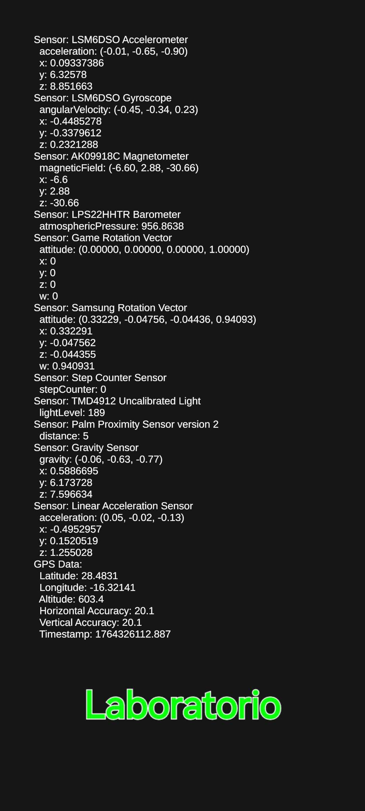
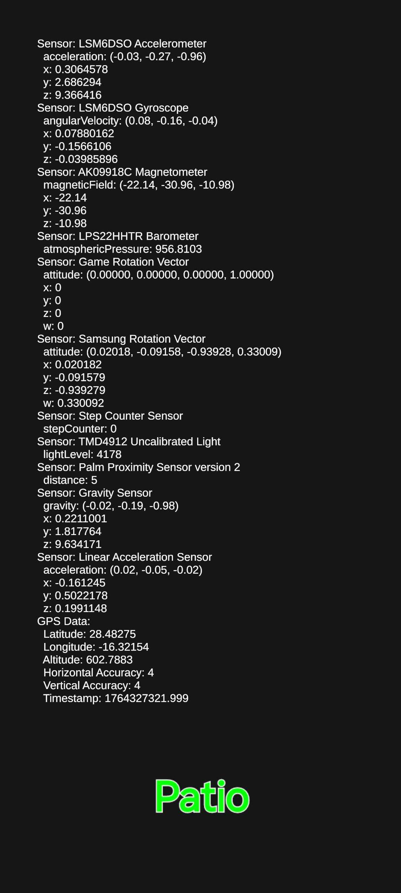

En esta práctica se ha trabajado con los sensores Android a con los que Unity provee una interfaz.

1. Crear una aplicación en Unity que muestre en la UI los valores de todos los sensores disponibles en tu móvil. Incluir en el Readme una medida de los valores en el laboratorio y otra en el jardin de la ESIT.

2. Crear una apk que oriente alguno de los guerreros de la práctica mirando siempre hacia el norte, avance con una aceleración proporcional a la del dispositivo y lo pare cuando el dispositivo esté fuera de un rango de latitud, longitud dado. El acelerómetro nos dará la velocidad del movimiento. A lo largo del eje z (hacia adelante y hacia atrás), se produce el movimiento inclinando el dispositivo hacia adelante y hacia atrás. Sin embargo, necesitamos invertir el valor z porque la orientación del sistema de coordenadas corresponde con el punto de vista del dispositivo. Queremos que la rotación final coincida con la orientación cuando mantenemos el dispositivo en la posición Horizontal Izquierda. Esto ocurre cuando la izquierda en la posición vertical ahora es la parte inferior. Aplicar las rotaciones con interpolación  Slerp en un quaternion.
